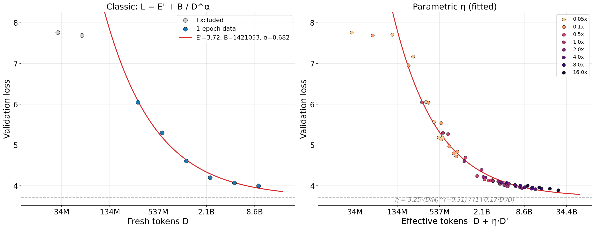
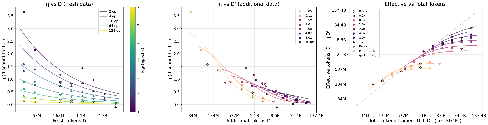
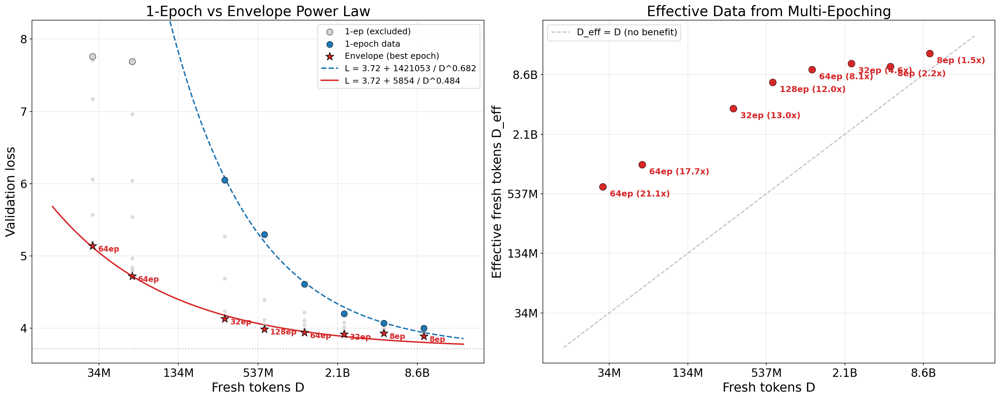
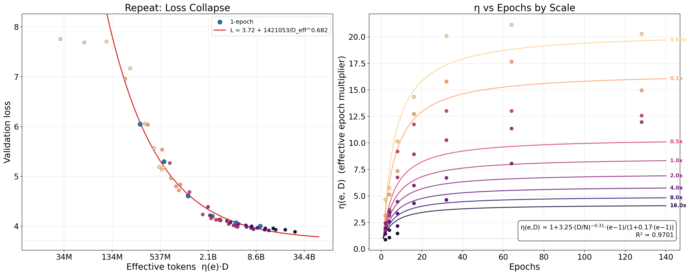

# Multi-Epoch Scaling Laws: Three Functional Forms

## Setup

We train a 30M-parameter model on DCLM data at 8 chinchilla scales (0.05x -- 16x, where 1x = 600M tokens) and up to 128 epochs per scale. All forms share the classic 1-epoch Chinchilla baseline fitted on scales $\geq$ 0.5x:

$$L = E + \frac{B}{D^\beta}, \quad E=3.72,\; B=1{,}421{,}053,\; \beta=0.682,\; R^2=0.992$$

---

## Form 1: Ad-Hoc (Token Discount)

$$L = E' + \frac{B}{\left(D + \eta \cdot D'\right)^\alpha}$$

where $D' = (e-1) \cdot D$ is additional tokens from repetition, and $\eta$ is a discount factor on those extra tokens.

**Fitting:** $E'$, $B$, $\alpha$ from 1-epoch data; then fit $\eta$ as a parametric function:

$$\eta(D, D') = \frac{c \cdot \left(\frac{D}{N}\right)^{-\gamma}}{1 + \beta_{\text{sat}} \cdot \frac{D'}{D}}$$

This is Michaelis-Menten in $D'/D$: $\eta \cdot D'$ saturates as $D' \to \infty$. The $D$-dependence captures that small datasets benefit more from repetition.

**Key features:**
- Per-point $\eta$ can be solved analytically from each data point
- Parametric $\eta$ captures both data-richness decay and saturation
- 3 params for $\eta$ on top of the 3 classic params

**Results:**

*Left: 1-epoch fit. Right: parametric $\eta$ collapse (all points mapped to effective tokens).*

*Left: $\eta$ vs $D$. Middle: $\eta$ vs $D'$. Right: effective tokens $D + \eta \cdot D'$ vs total tokens $D + D'$ (i.e., FLOPs). Circles = per-point $\eta$, crosses = parametric $\eta$, lines = parametric fit.*

**Extension to paraphrasing:**
- $D'$ becomes a mix of repeated and paraphrased tokens
- Refit constants in $\eta$ for each pretraining data strategy (repeat, paraphrase, etc.) and directly compare the resulting $\eta$ curves
- Main advantage: provides a common currency for comparing pretraining data strategies
- Limitation: conflates the epoch effect and data-quality effect into a single $\eta$ -- hard to disentangle "is paraphrasing better because it's higher quality, or because it reduces effective repetition?"

---

## Form 2: Envelope (Shifted Power Law)

$$L_{\min} = E + \frac{B_{\text{multi}}}{D^{\beta_{\text{multi}}}}$$

For each fresh data size $D$, find the minimum loss across all epoch counts. Fit a second power law to these envelope points, sharing $E$ from the 1-epoch fit.

**Fitting:** $E$ fixed from 1-epoch; fit $B_{\text{multi}}$, $\beta_{\text{multi}}$ on all 8 envelope points.

$$B_{\text{multi}}=5854, \quad \beta_{\text{multi}}=0.484, \quad R^2=0.985$$

The exponent drops from 0.682 (1-epoch) to 0.484 (envelope), meaning loss decreases more slowly with $D$ when you're already multi-epoching optimally.

**Key features:**
- Simplest form: just two power laws
- Completely abstracts away epoch count (compute)

**Results:**

*Left: both power laws. Stars = envelope points annotated with optimal epoch count. Right: $D_{\text{eff}}$ vs $D$ showing the value of multi-epoching.*

**Extension to paraphrasing:** The form becomes $$L_{\min,\text{para}} = E + \frac{B_{\text{multi}}}{\left(D + \eta_{\text{para}} \cdot D'\right)^{\beta_{\text{multi}}}}$$

- Requires running many $(D, D')$ combinations through many epochs to find $L_{\min}$ per combo, then fitting $\eta_{\text{para}}$
- Unclear whether $\beta_{\text{multi}}$ from repeat-only data transfers to the mixed setting
- Two-stage fitting (first envelope, then $\eta_{\text{para}}$) propagates errors -- envelope R$^2$=0.985 means residuals distort downstream $\eta_{\text{para}}$
- In practice: per-point $\eta_{\text{para}}$ ranged from 0.11 to 0.91 across 4 scales, with 1.0x as a clear outlier
- Operationally annoying: need to sweep epochs at every $(D, D')$ combo just to find the envelope

---

## Form 3: Epoch Discount

$$L = E + \frac{B}{\left(\eta_{\text{epoch}}(e, D) \cdot D\right)^\beta}$$

where $\eta_{\text{epoch}}$ is an effective epoch multiplier:

$$\eta_{\text{epoch}}(e, D) = 1 + a \cdot \left(\frac{D}{N}\right)^{-\gamma} \cdot \frac{e - 1}{1 + b \cdot (e - 1)}$$

**Fitting:** $E$, $B$, $\beta$ from 1-epoch; then fit $a$, $\gamma$, $b$ on all 44 multi-epoch data points.

$$a=3.25, \quad \gamma=0.31, \quad b=0.17, \quad R^2=0.970$$

**Key features:**
- Models each (scale, epoch) pair, not just the envelope
- $\eta(1, D) = 1$ exactly (baseline)
- Michaelis-Menten saturation: $\eta(\infty, D) = 1 + \frac{a}{b} \cdot \left(\frac{D}{N}\right)^{-\gamma}$
- Saturation ceiling depends on $D$: ~20x at 0.05x scale, ~4x at 16x scale

**Results:**

*Left: loss collapse after mapping to effective tokens. Right: $\eta$ vs epochs by scale with fitted curves.*

**Extension to paraphrasing:** The natural form is $L = E + \frac{B}{\left(\eta_{\text{epoch}}\!\left(e,\; D+D'\right) \cdot \left(D + \eta_{\text{para}} \cdot D'\right)\right)^\beta}$ where $e = \frac{\text{epochs} \cdot D}{D + D'}$ is effective passes through the mixed pool.

- Cleanest separation of epoch effect ($\eta_{\text{epoch}}$) from data-quality effect ($\eta_{\text{para}}$)
- Entangled in practice: need enough variation in both epoch count and $D'/D$ ratio to pin them down independently
- With current data (4 scales, fixed $D'/D \approx 0.48$), $\eta_{\text{para}}$ ranges from 1.3 to 4.4 depending on whether $\eta_{\text{epoch}}$ is fixed from repeat or jointly refit
- Unclear whether $\eta_{\text{epoch}}$ from repeat-only training transfers to the mixed setting
- Error propagation from two-stage fit remains a concern

---

## Comparison

| | Ad-Hoc | Envelope | Epoch Discount |
|---|---|---|---|
| **What it models** | Discount on extra tokens $D'$ | Best achievable loss per $D$ | Effective epoch multiplier |
| **Granularity** | Per $(D, D')$ pair | Per $D$ (envelope only) | Per $(D, e)$ pair |
| **Free params** (beyond 1-ep) | 3 ($c, \gamma, \beta_{\text{sat}}$) | 2 ($B_{\text{multi}}, \beta_{\text{multi}}$) | 3 ($a, \gamma, b$) |
| **$R^2$** | ~0.97 (on loss) | 0.985 (on envelope) | 0.970 (on all multi-epoch) |
| **Abstracts away epochs?** | Partially (via $D'$) | Completely | No (explicit input) |
| **Para extension** | Refit $\eta$ per strategy; direct comparison | Needs many $(D, D')$ combos; error propagates | Needs varied $D'/D$ ratios; identifiability issue |

All three tell a consistent story: multi-epoching provides substantial benefit at small $D$ (up to ~20x effective data) with diminishing returns, and the benefit shrinks at larger $D$.

**What experiments would help most:**
- More paraphrase scales (especially larger $D$ where repeat vs para differences are more pronounced)
- Varying the $D'/D$ ratio (e.g., $D' = 0.25D,\; 0.5D,\; 1.0D,\; 2.0D$) at fixed $D$ to disentangle $\eta_{\text{epoch}}$ from $\eta_{\text{para}}$
- 370M model results to check if the fitted constants transfer across model sizes
